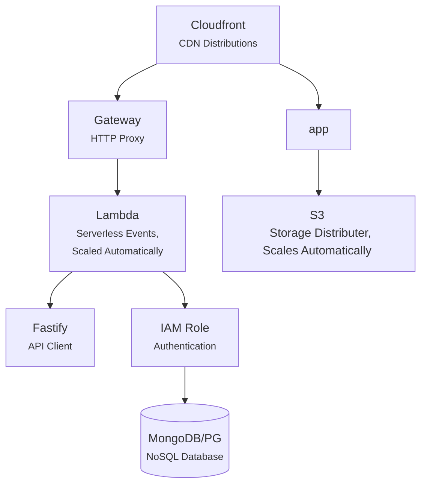

Fnx 

```mermaid

flowchart

cf --> gw --> lambda --> api
cf --> app --> s3
lambda  --> role --> db 

cf["Cloudfront <br/> <span style='font-size:smaller'> CDN Distributions </span>"]

api["Fastify <br/> <span style='font-size:smaller'> API Client </span>"]
lambda["Lambda <br/> <span style='font-size:smaller'> Serverless Events,<br>Scaled Automatically </span>"]
gw["Gateway <br/> <span style='font-size:smaller'> HTTP Proxy </span>"]
db[("MongoDB/PG <br/> <span style='font-size:smaller'> NoSQL Database </span>")]
role["IAM Role <br/> <span style='font-size:smaller'> Authentication </span>"]

app
s3["S3 <br/> <span style='fontsize:smaller'> Storage Distributer, Scales Automatically </span>"]

```
